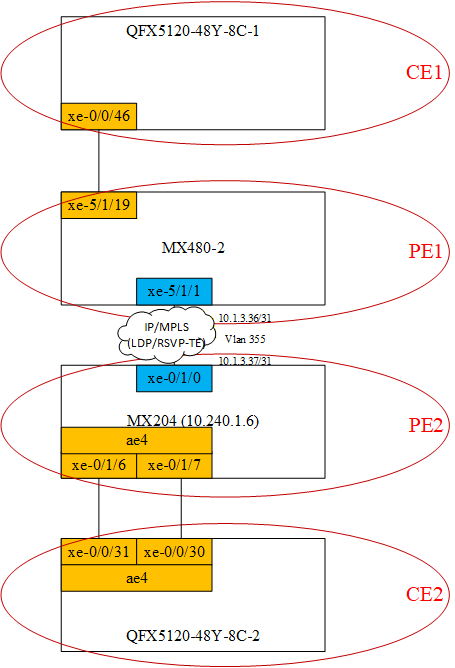

# EVPN

## Type Route

* Type 1 - Ethernet Auto-Discovery (A-D) Route [It is used for multihoming mechanisms (altering, mass recall of routes, split-horizon)]
* Type 2 - MAC/IP Advertisement Route [Announces MAC addresses and optionally associated IP addresses.]
```html
2:10.240.1.3:400::104::88:30:37:39:73:a0/304 MAC/IP        
                   *[EVPN/170] 00:06:05
                       Indirect
2:10.240.1.3:400::104::88:30:37:39:73:a0::10.10.104.150/304 MAC/IP        
                   *[EVPN/170] 00:06:05
                       Indirect
2:10.240.1.6:400::104::d0:07:ca:75:2f:07/304 MAC/IP        
                   *[BGP/170] 00:06:06, localpref 100, from 10.240.1.6
                      AS path: I, validation-state: unverified
                    >  to 10.1.3.37 via xe-5/1/1.335, label-switched-path PE1_to_PE2
2:10.240.1.6:400::104::d0:07:ca:75:2f:07::10.10.104.245/304 MAC/IP        
                   *[BGP/170] 00:06:06, localpref 100, from 10.240.1.6
                      AS path: I, validation-state: unverified
                    >  to 10.1.3.37 via xe-5/1/1.335, label-switched-path PE1_to_PE2
```
* Type 3 - Inclusive Multicast Ethernet Tag Route [It is used to automatically detect all PE in the domain and organize the delivery of BUM traffic (Broadcast, Unknown unicast, Multicast)]
```html
3:10.240.1.3:400::104::10.240.1.3/248 IM            
                   *[EVPN/170] 17:19:37
                       Indirect
3:10.240.1.6:400::104::10.240.1.6/248 IM            
                   *[BGP/170] 00:06:05, localpref 100, from 10.240.1.6
                      AS path: I, validation-state: unverified
                    >  to 10.1.3.37 via xe-5/1/1.335, label-switched-path PE1_to_PE2
```
* Type 4 - Ethernet Segment Route [Allows PE to discover each other within the same Ethernet (ES) segment]
* Type 5 - IP Prefix Route [Announces IP prefixes (networks), used to build L3VPN on top of EVPN]

## Core Network



> Сonfigure between P/PE router OSPF/IS-IS, MPLS, RSVP, LSP, BGP. Create LSP PE1 <---> PE2
> 
> Example PE2 (10.240.1.6) OSPF:

```html
set interfaces xe-0/1/0 flexible-vlan-tagging
set interfaces xe-0/1/0 mtu 9216
set interfaces xe-0/1/0 encapsulation flexible-ethernet-services
set interfaces xe-0/1/0 unit 335 vlan-id 335
set interfaces xe-0/1/0 unit 335 family inet address 10.1.3.37/31
set interfaces xe-0/1/0 unit 335 family mpls
```
```html
set routing-options router-id 10.240.1.6
set protocols ldp interface xe-0/1/0.335
set protocols mpls interface xe-0/1/0.335
set protocols ospf traffic-engineering
set protocols ospf area 0.0.0.0 interface lo0.0 passive
set protocols ospf area 0.0.0.0 interface xe-0/1/0.335 interface-type p2p
set protocols rsvp interface xe-0/1/0.335
```
```html
set protocols mpls label-switched-path PE2_to_PE1 to 10.240.1.3
```
```html
set protocols bgp group IBGP type internal
set protocols bgp group IBGP local-address 10.240.1.6
set protocols bgp group IBGP family inet-vpn unicast
set protocols bgp group IBGP family l2vpn signaling
set protocols bgp group IBGP family evpn signaling
set protocols bgp group IBGP neighbor 10.240.1.3 description PE1
```

> ECMP (*optional)

```html
set policy-options policy-statement lb then load-balance per-packet
set routing-options forwarding-table export lb
```

## Configuring the VLAN-based EVPN service (one vlan that belongs to the same bridge domain)

### CE1 (CE2 similarly, except for the port number)

```html
set interfaces xe-0/0/46 flexible-vlan-tagging
set interfaces xe-0/0/46 mtu 9216
set interfaces xe-0/0/46 encapsulation extended-vlan-bridge
set interfaces xe-0/0/46 unit 104 vlan-id 104
```
```html
set interfaces irb unit 104 family inet address 10.10.104.150/24
```
```html
set vlans test_104 vlan-id 104
set vlans test_104 interface xe-0/0/46.104
set vlans test_104 l3-interface irb.104
```

### PE1 (PE2 similarly, except for the port number and RD)

```html
[edit interfaces xe-5/1/19]
+    unit 104 {
+        description CE1-EVPN-104;
+        encapsulation vlan-bridge;
+        vlan-id 104;
+        family bridge;
+    }
[edit routing-instances]
+   evpn_vlan104 {
+       instance-type evpn;
+       protocols {
+           evpn;
+       }
+       vlan-id 104;
+       interface xe-5/1/19.104;
+       route-distinguisher 10.240.1.3:400;
+       vrf-target target:65000:400;
+   }
```

```html
set interfaces xe-5/1/19.104 vlan-id 104
set interfaces xe-5/1/19.104 encapsulation vlan-bridge
set interfaces xe-5/1/19.104 description EVPN-104
set interfaces xe-5/1/19.104 family bridge
```
```html
set routing-instances evpn_vlan104 instance-type evpn
set routing-instances evpn_vlan104 vlan-id 104
set routing-instances evpn_vlan104 interface xe-5/1/19.104 
set routing-instances evpn_vlan104 route-distinguisher 10.240.1.3:400
set routing-instances evpn_vlan104 vrf-target target:65000:400
set routing-instances evpn_vlan104 protocols evpn
```

### Troubleshooting

```html
> show evpn database 

Instance: evpn_vlan104
VLAN  DomainId  MAC address        Active source                  Timestamp        IP address
104             64:64:9b:14:23:c1  10.240.1.6                     Mar 18 09:39:28  10.10.104.3
104             88:30:37:39:73:a0  xe-5/1/19.104                  Mar 18 09:39:00  10.10.104.150
104             d0:07:ca:75:2f:07  10.240.1.6                     Mar 18 09:38:59  10.10.104.245
104             dc:2c:6e:5b:a4:d3  10.240.1.6                     Mar 18 09:39:26  10.10.104.249
```
```html
> show evpn mac-table

MAC flags       (S -static MAC, D -dynamic MAC, L -locally learned, C -Control MAC
    O -OVSDB MAC, SE -Statistics enabled, NM -Non configured MAC, R -Remote PE MAC, P -Pinned MAC)

Routing instance : evpn_vlan104
 Bridging domain : __evpn_vlan104__, VLAN : 104
   MAC                 MAC      Logical          NH     MAC         active
   address             flags    interface        Index  property    source
   64:64:9b:14:23:c1   DC                        1048577            10.240.1.6                    
   88:30:37:39:73:a0   D        xe-5/1/19.104   
   d0:07:ca:75:2f:07   DC                        1048577            10.240.1.6                    
   dc:2c:6e:5b:a4:d3   DC                        1048577            10.240.1.6 
```
```html
> show evpn instance evpn_vlan104 

                            Intfs       IRB intfs         MH      MAC addresses
Instance                    Total   Up  Total   Up  Nbrs  ESIs    Local  Remote
evpn_vlan104                    2    2      0    0     1     0        1       3
```
```html
> show route table evpn_vlan104 evpn-mac-address 88:30:37:39:73:a0

evpn_vlan104.evpn.0: 10 destinations, 10 routes (10 active, 0 holddown, 0 hidden)
+ = Active Route, - = Last Active, * = Both

2:10.240.1.3:400::104::88:30:37:39:73:a0/304 MAC/IP        
                   *[EVPN/170] 00:02:03
                       Indirect
2:10.240.1.3:400::104::88:30:37:39:73:a0::10.10.104.150/304 MAC/IP        
                   *[EVPN/170] 00:02:03
                       Indirect
```