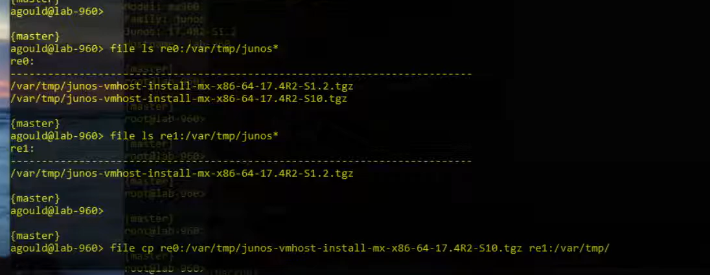
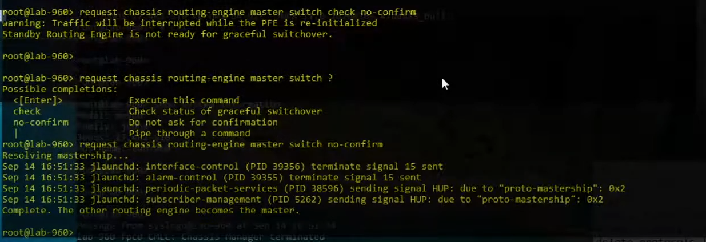
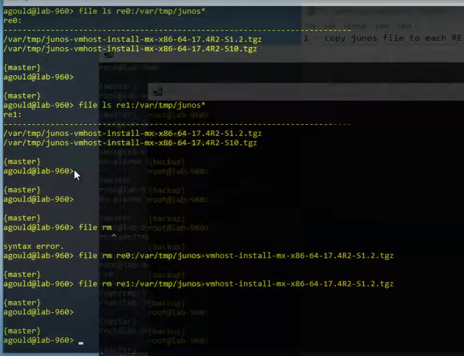

# JunOS usb install
```html
1. USB flash formatted as FAT-32.
2. Download Junos. Example: junos-vmhost-install-usb-mx-x86-64-22.4R3.25.img 
3. Use Rufus/UltraISO burn the image to a USB flash drive.
4. Router has been powered off
5. Insert the USB flash drive into the USB port on the router
6. Power on the router. Powering on the router starts the loader script and checks for a Junos OS package on the USB flash drive.
7. When the install prompt appears, enter Yes
8. When the installation has completed, reboot the router:
```
**user@host> request system reboot**
```html
9. After the reboot has completed, log in and verify that the new version of the software has been properly installed.
```
**user@host> show version**
# JunOS update:
```html
show version
request system storage cleanup
request vmhost snapshot
```
```html
Copy junos-vmhost-install-mx-x86-64-21.4R3-S5.4.tgz to juniper: /var/tmp/

Windows:
>cd C:\Users\alexero\Desktop\Junos
>certutil -hashfile jinstall-host-qfx-5e-flex-x86-64-21.4R3-S10.13-secure-signed.tgz MD5

Хэш MD5 jinstall-host-qfx-5e-flex-x86-64-21.4R3-S10.13-secure-signed.tgz:
7d59ce5be99c8671c3eca1faf697a361
CertUtil: -hashfile — команда успешно выполнена.

Juniper:
user@host> start shell user root 
root@host:/var/home/remoteadmin # cd /var/tmp/
root@host:/var/tmp # ls -la junos*

-rw-r--r--  1 remoteadmin  wheel  3681691804 Mar 25 12:23 junos-vmhost-install-mx-x86-64-21.4R3-S5.4.tgz

root@host:/var/tmp # md5 junos-vmhost-install-mx-x86-64-21.4R3-S5.4.tgz 

MD5 (junos-vmhost-install-mx-x86-64-21.4R3-S5.4.tgz) = 2529eb6f65c1320a833e751e3221f547

root@host:/var/tmp # exit
exit

user@host> 
```
```html
request vmhost software no-validate /var/tmp/***-21.4R3-S5.4.tgz
request vmhost software add /var/tmp/***-21.4R3-S5.4.tgz
request vmhost reboot
```
# Dual RE



**Upload junos-vmhost-install-\* to re0 and DISABLE GRES**
```html
>file ls re0:/var/tmp/junos*
>file ls re1:/var/tmp/junos*

>file cp re0:/var/tmp/junos-vmhost-install-mx-x86-64-21.4R3-S5.4.tgz re1:/var/tmp/
```
```html
>request routing-engine login re1 - re1 backup RE
>show chassis hardware - not show the output to backup RE
>request vmhost software add /var/tmp/... no-validate re1 reboot | no-more
```

```html
>request chassis routing-engine master switch check no-confirm
warning: Traffic will be interrupted while the PFE is re-initialized
Standby Routing Engine is not ready for graceful switchover.

>request chassis routing-engine master switch no-confirm
```
**Login on RE0**
```html
request routing-engine login re0 - login re0 new backup RE
request vmhost software add /var/tmp/... no-validate re0 reboot | no-more
```
**Enable GRES**
```html
set system commit synchronize
set chassis redundancy routing-engine 0 master
set chassis redundancy routing-engine 1 backup
set chassis redundancy graceful-switchover
set routing-options nonstop-routing
set protocols layer2-control nonstop-bridging
```
```html
> show task replication    
        Stateful Replication: Enabled
        RE mode: Master

    Protocol                Synchronization Status
    OSPF                    Complete              
    BGP                     Complete              
    MPLS                    Complete              
    RSVP                    Complete              
    LDP                     Complete
```
```html
>request chassis routing-engine master switch check no-confirm
Switchover Ready


>request chassis routing-engine master switch no-confirm
```

```html
file rm re0:/var/tmp/junos-vmhost-install-mx-x86-64-21.4R3-S5.4.tgz
```
```html
>request vmhost snapshot

warning: Existing data on the target may be lost
Proceed ? [yes,no] (no) yes 

warning: Proceeding with vmhost snapshot
Current root details,           Device sda, Label: jrootb_P, Partition: sda4
Snapshot admin context from current boot disk to target disk ...
Proceeding with snapshot on secondary disk
Mounting device in preparation for snapshot...
Cleaning up target disk for snapshot ...
Creating snapshot on target disk from current boot disk ...
Snapshot created on secondary disk.
Software snapshot done
```
```html
> show vmhost snapshot 
UEFI    Version: NGRE_v00.53.00.01

Secondary Disk, Snapshot Time: Thu Sep  4 14:50:01 +05 2025

Version: set p
VMHost Version: 7.2552
VMHost Root: vmhost-x86_64-21.4R3-S4-20230404_1142_builder
VMHost Core: vmhost-core-x86-64-21.4R3-S5.4
kernel: 5.2.60-rt15-LTS19
Junos Disk: junos-install-mx-x86-64-21.4R3-S5.4

Version: set b
VMHost Version: 7.2955
VMHost Root: vmhost-x86_64-23.4R2-S5-20250515_2123_builder
VMHost Core: vmhost-core-x86-64-23.4R2-S5.6
kernel: 5.2.60-rt15-LTS19
Junos Disk: junos-install-mx-x86-64-23.4R2-S5.6
```
# QFX
```html
>request system software add /var/tmp/jinstall-host-qfx-5e-flex-x86-64-23.4R2-S4.11-secure-signed.tgz
```