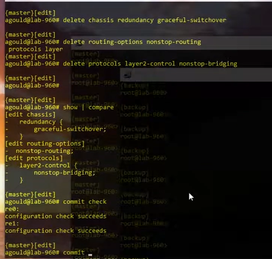

# JunOS usb install
```html
1. USB flash formatted as FAT-32.
2. Download Junos. Example: junos-vmhost-install-usb-mx-x86-64-22.4R3.25.img 
3. Use Rufus/UltraISO burn the image to a USB flash drive.
4. Router has been powered off
5. Insert the USB flash drive into the USB port on the router
6. Power on the router. Powering on the router starts the loader script and checks for a Junos OS package on the USB flash drive.
7. When the install prompt appears, enter Yes
8. When the installation has completed, reboot the router:
```
**user@host> request system reboot**
```html
9. After the reboot has completed, log in and verify that the new version of the software has been properly installed.
```
**user@host> show version**
# JunOS update:
```html
show version
request system storage cleanup
request vmhost snapshot
```
```html
Copy junos-vmhost-install-mx-x86-64-21.4R3-S5.4.tgz to juniper: /var/tmp/

Windows:
C:\Users\user>certutil -hashfile C:\Users\user\Desktop\junos-vmhost-install-mx-x86-64-21.4R3-S5.4.tgz MD5
Хэш MD5 C:\Users\alexero\Desktop\junos-vmhost-install-mx-x86-64-21.4R3-S5.4.tgz:
2529eb6f65c1320a833e751e3221f547
CertUtil: -hashfile — команда успешно выполнена.

Juniper:
user@host> start shell user root 
root@host:/var/home/remoteadmin # cd /var/tmp/
root@host:/var/tmp # ls -la junos*

-rw-r--r--  1 remoteadmin  wheel  3681691804 Mar 25 12:23 junos-vmhost-install-mx-x86-64-21.4R3-S5.4.tgz

root@host:/var/tmp # md5 junos-vmhost-install-mx-x86-64-21.4R3-S5.4.tgz 

MD5 (junos-vmhost-install-mx-x86-64-21.4R3-S5.4.tgz) = 2529eb6f65c1320a833e751e3221f547

root@host:/var/tmp # exit
exit

user@host.noyabrsk> 
```
```html
request vmhost software no-validate /var/tmp/***-21.4R3-S5.4.tgz
request vmhost software add /var/tmp/***-21.4R3-S5.4.tgz
request vmhost reboot
```
# Dual RE



request vmhost software add /var/tmp/... no-validate re1 reboot | no-more

request vmhost software add /var/tmp/... no-validate re0 reboot | no-more
```Enable GRES``` 
```and switch master RE```
