# SRX
## Traffic Flow SRX
```html
show security flow session
show configuration groups junos-defaults applications
```

```html
2015-07-25T10:49:35.408+03:00 srx RT_FLOW:  RT_FLOW_SESSION_CREATE: session created 10.90.80.50/55871->87.240.131.99/80 junos-http 9.9.9.9/29419->87.240.131.99/80 src-nat-rule1 None 6 DEBUG-DENY-ANY-LOG VPN PX 21949 N/A(N/A) gr-0/0/0.14 HTTP INCONCLUSIVE No

Код (тип) сообщения = RT_FLOW
Адрес источника (source-address) = 10.90.80.50
Порт источника (source-port) = 55871
Адрес назначение (destination-address) = 87.240.131.99
Порт назначение (destination-port) = 80
Имя приложения (service-name) = junos-http
Адрес источника после nat (nat-source-address) = 9.9.9.9
Порт источника после nat (nat-source-port) = 29419
Адрес назначение после nat (nat-destination-address) = 87.240.131.99
Порт назначение после nat (nat-destination-port) = 80
Имя правила по которому делался source nat (src-nat-rule-name) = src-nat-rule1
Имя правила по которому делался destination nat (dst-nat-rule-name) = None
None т.к. в данном случае srx не делает destination nat.
Номер протокола (protocol-id) = 6, см. /etc/protocols (6 - tcp, 17 - udp, 1 - icmp)
Имя политики безопасности (policy-name) = DEBUG-DENY-ANY-LOG
Зона из которой идет трафик (source-zone-name) = VPN
Зона в которую идет трафик (destination-zone-name) = PX
Номер сессии (session-id-32) = 21949
Имя пользователя (username) = N/A
Принадлежность пользователя (roles) = N/A
N/A т.к. на srx не настроено source-identity.
Интерфейс через который пришел трафик (packet-incoming-interface) = gr-0/0/0.14
Тип приложения (application) = HTTP
Тип вложенного приложения (nested-application) = INCONCLUSIVE
SRX пока не разобрался что это за приложение и ставит тип incocnclusive т.к. прошел только syn пакет.
Шифрование (encrypted) = No
```
## Policy ReMatch
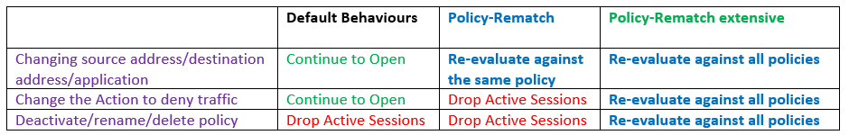
```html
set security policies policy-rematch 
set security policies policy-rematch extensive 
```
## SRX NAT
### Source NAT
#### Source NAT Interface
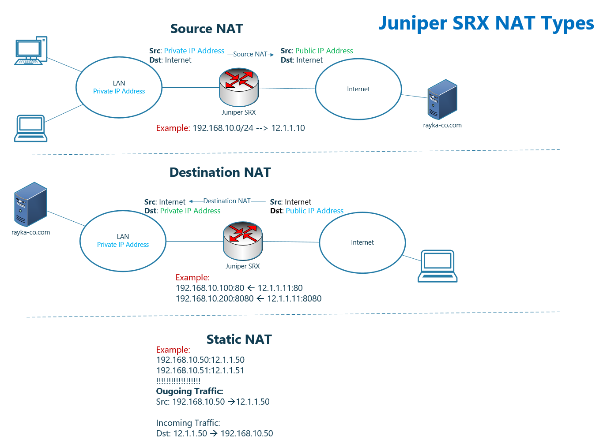
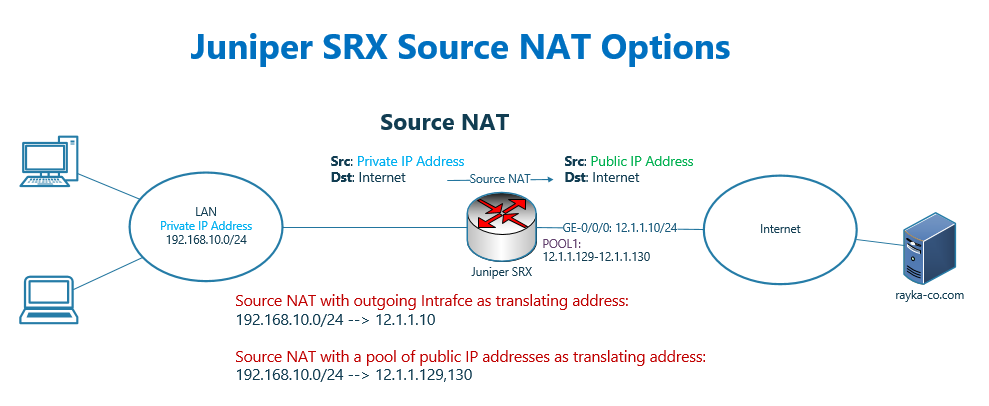
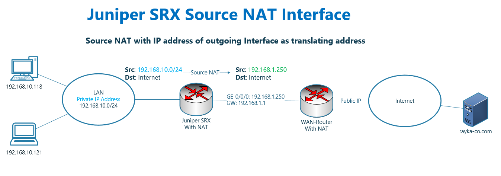
```html
set security nat source rule-set SOURCE-NAT from zone inside
set security nat source rule-set SOURCE-NAT to zone outside
set security nat source rule-set SOURCE-NAT rule PAT-INTERFACE match source-address 192.168.10.0/24
set security nat source rule-set SOURCE-NAT rule PAT-INTERFACE then source-nat interface 
```
```html
> show security nat source summary 
> show security flow session
```
#### Source NAT Pool
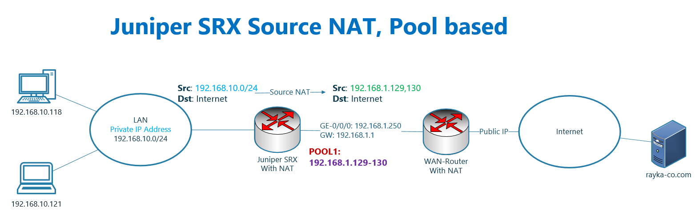
```html
set security nat source pool POOL1 address 192.168.1.129 to 192.168.1.130

set security nat source rule-set SOURCE-NAT from zone inside
set security nat source rule-set SOURCE-NAT to zone outside
set security nat source rule-set SOURCE-NAT rule NAT-POOL match source-address 192.168.10.0/24
set security nat source rule-set SOURCE-NAT rule NAT-POOL then source-nat pool POOL1
set security nat source address-persistent
```
#### Juniper SRX Source NAT Proxy ARP
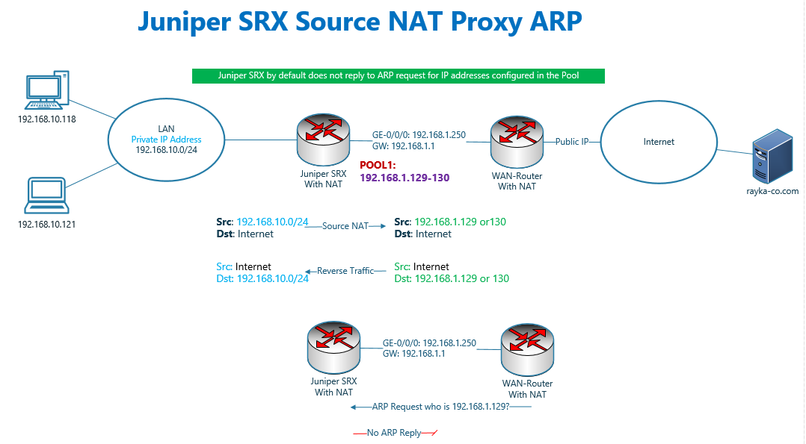
```html
As you know, the source address of outgoing traffic s translated to IP addresses configured in the pool, 192.168.1.129 and 192.168.1.130.
Therefore destination address of return traffic before reaching juniper SRX is the IP addresses configured in the Pool.
The problem is that, by default juniper SRX, unlike Cisco Firewalls, does not reply to ARP request to IP addresses configured in NAT pool. Therefore return traffic never reach juniper SRX.
In juniper SRX, Proxy ARP for IP addresses inside the pool must be explicitly configured.
This is the command that we enable proxy ARP for IP addresses inside the Pool.
```
```html
set security nat proxy-arp interface ge-0/0/0.0 address 192.168.1.129 to 192.168.1.130
```
#### Juniper SRX Source NAT “port no-translation” and “overflow-pool” options
```html
With configuring the option “port no-translation”, in the NAT pool, 
we disable port translation and therefore the number of users accessing internet 
are limited to the number of public IP addresses.
```
```html
set security nat source pool POOL1 address 192.168.1.129
set security nat source pool POOL1 port no-translation
```
```html
Now with the option “overflow-pool interface” in the NAT pool, 
we can ask juniper when the IP address of pool is exhausted, 
then you have to translate the IP address of other users to the outgoing interface with port translation.
```
```html
set security nat source pool POOL1 overflow-pool interface
```
#### Juniper SRX Source-NAT off Fundamental
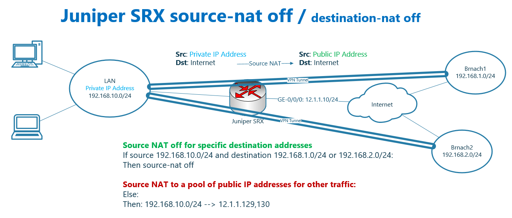
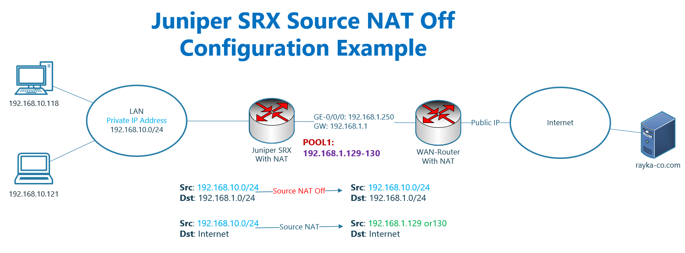
```html
# run show configuration | display set | grep "nat source"                             
set security nat source pool POOL1 address 192.168.1.129/32
set security nat source pool POOL1 port no-translation
set security nat source pool POOL1 overflow-pool interface
set security nat source address-persistent
set security nat source rule-set SOURCE-NAT from zone inside
set security nat source rule-set SOURCE-NAT to zone outside
set security nat source rule-set SOURCE-NAT rule NAT-POOL match source-address 192.168.10.0/24
set security nat source rule-set SOURCE-NAT rule NAT-POOL then source-nat pool POOL1
```
```html
set security nat source rule-set SOURCE-NAT rule SNAT-OFF match source-address 192.168.10.0/24       
set security nat source rule-set SOURCE-NAT rule SNAT-OFF match destination-address 192.168.1.0/24   
set security nat source rule-set SOURCE-NAT rule SNAT-OFF then source-nat off  

insert security nat source rule-set SOURCE-NAT rule SNAT-OFF before rule NAT-POOL 
```
### Destination NAT
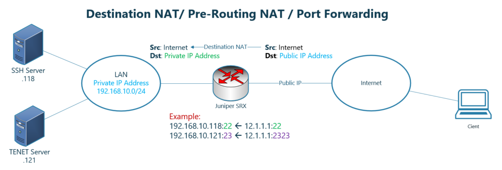
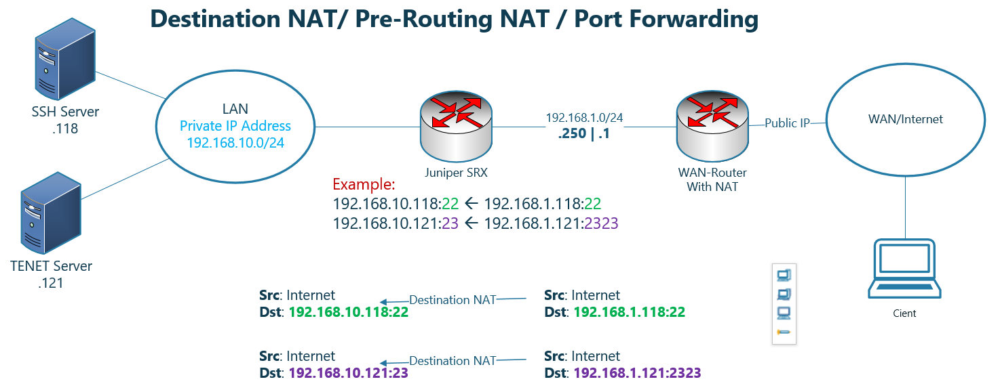
```html
set security policies from-zone outside to-zone inside policy PERMIT-ALL match source-address any
set security policies from-zone outside to-zone inside policy PERMIT-ALL match destination-address NET_192_168_10_0__24
set security policies from-zone outside to-zone inside policy PERMIT-ALL match application any
set security policies from-zone outside to-zone inside policy PERMIT-ALL then permit
set security policies from-zone outside to-zone inside policy PERMIT-ALL then log session-init
```
```html
set security nat destination pool SSH address 192.168.10.118/32
set security nat destination pool SSH address port 22

set security nat destination pool TENET address 192.168.10.121/32
set security nat destination pool TENET address port 23

set security nat destination rule-set DNAT from zone outside

set security nat destination rule-set DNAT rule SSH match destination-address 192.168.1.118/32
set security nat destination rule-set DNAT rule SSH match destination-port 22
set security nat destination rule-set DNAT rule SSH then destination-nat pool SSH

set security nat destination rule-set DNAT rule TELNET match destination-address 192.168.1.121/32
set security nat destination rule-set DNAT rule TELNET match destination-port 2323
set security nat destination rule-set DNAT rule TELNET then destination-nat pool TENET
         
set security nat proxy-arp interface ge-0/0/0.0 address 192.168.1.118/32
set security nat proxy-arp interface ge-0/0/0.0 address 192.168.1.121/32
```
```html
> show security nat destination rule all
```
### Static NAT
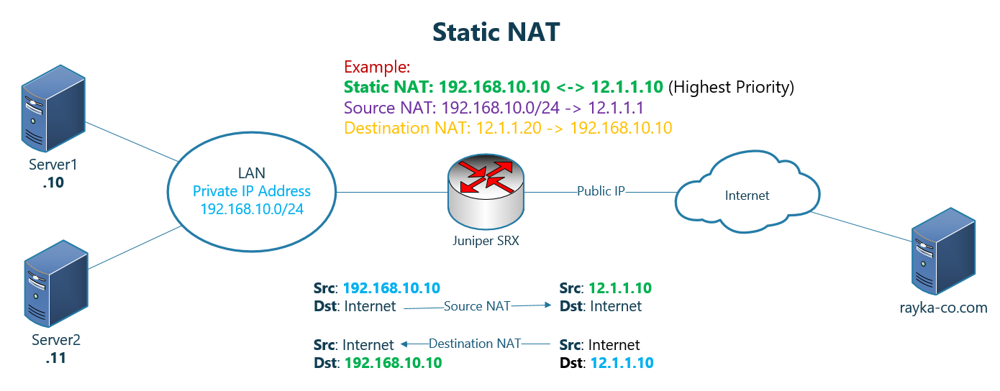
```html
If you remember, in the Juniper SRX traffic flow, static NAT has the highest priority among all other NAT policies including source NAT and destination NAT and even before routing decision and security policy.
In other words, if an IP address in the packet is matched with both destination NAT and static NAT or both source NAT and static NAT, static NAT translation will be applied to the IP address.
As an example, in this topology, a one-to-one mapping is created between two IP addresses, 192.168.10.10 and 12.1.1.10. It has the highest priority even though 192.168.10.10 matches both destination NAT and source NAT.
Static NAT is bidirectional. It means when traffic with the source IP address, 192.168.10.10 is coming from inside zone and is forwarded through juniper SRX, the IP address will be translated to 12.1.1.10.
It also applies to the traffic with destination IP address, 12.1.1.10, coming from outside zone, which will be translated to the IP address 192.168.10.10.
```
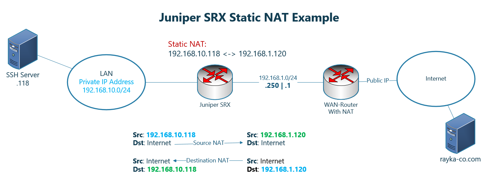
```html
set security nat static rule-set STATIC-NAT from zone outside
set security nat static rule-set STATIC-NAT rule 10_118_to_1_120 match destination-address 192.168.1.120/32
set security nat static rule-set STATIC-NAT rule 10_118_to_1_120 then static-nat prefix 192.168.10.118/32

set security nat proxy-arp interface ge-0/0/0.0 address 192.168.1.120/32
```
```html
> show security nat static rule all 
```