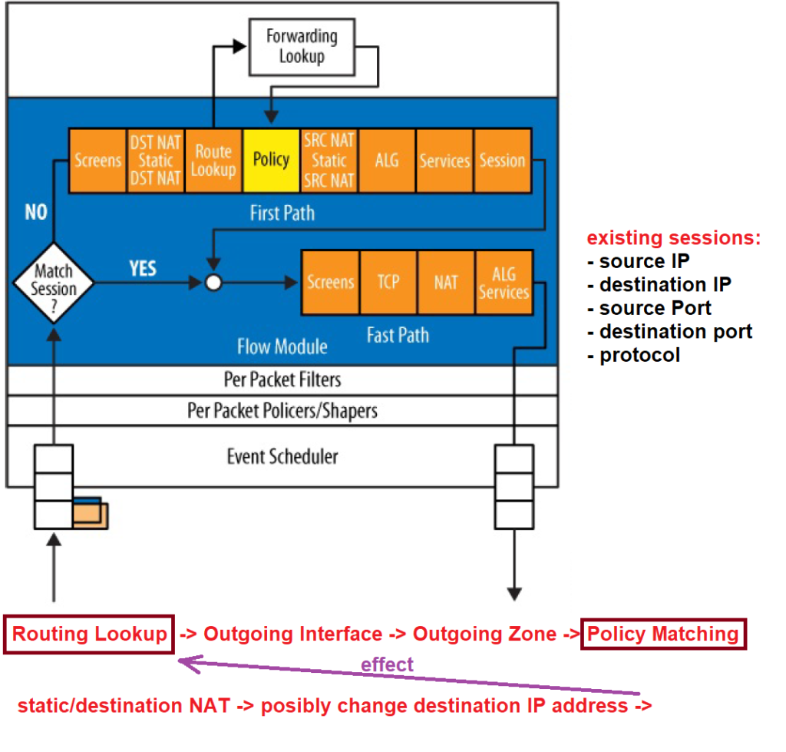

# SRX
```html
show security flow session
show configuration groups junos-defaults applications
```

```html
2015-07-25T10:49:35.408+03:00 srx RT_FLOW:  RT_FLOW_SESSION_CREATE: session created 10.90.80.50/55871->87.240.131.99/80 junos-http 9.9.9.9/29419->87.240.131.99/80 src-nat-rule1 None 6 DEBUG-DENY-ANY-LOG VPN PX 21949 N/A(N/A) gr-0/0/0.14 HTTP INCONCLUSIVE No

Код (тип) сообщения = RT_FLOW
Адрес источника (source-address) = 10.90.80.50
Порт источника (source-port) = 55871
Адрес назначение (destination-address) = 87.240.131.99
Порт назначение (destination-port) = 80
Имя приложения (service-name) = junos-http
Адрес источника после nat (nat-source-address) = 9.9.9.9
Порт источника после nat (nat-source-port) = 29419
Адрес назначение после nat (nat-destination-address) = 87.240.131.99
Порт назначение после nat (nat-destination-port) = 80
Имя правила по которому делался source nat (src-nat-rule-name) = src-nat-rule1
Имя правила по которому делался destination nat (dst-nat-rule-name) = None
None т.к. в данном случае srx не делает destination nat.
Номер протокола (protocol-id) = 6, см. /etc/protocols (6 - tcp, 17 - udp, 1 - icmp)
Имя политики безопасности (policy-name) = DEBUG-DENY-ANY-LOG
Зона из которой идет трафик (source-zone-name) = VPN
Зона в которую идет трафик (destination-zone-name) = PX
Номер сессии (session-id-32) = 21949
Имя пользователя (username) = N/A
Принадлежность пользователя (roles) = N/A
N/A т.к. на srx не настроено source-identity.
Интерфейс через который пришел трафик (packet-incoming-interface) = gr-0/0/0.14
Тип приложения (application) = HTTP
Тип вложенного приложения (nested-application) = INCONCLUSIVE
SRX пока не разобрался что это за приложение и ставит тип incocnclusive т.к. прошел только syn пакет.
Шифрование (encrypted) = No
```