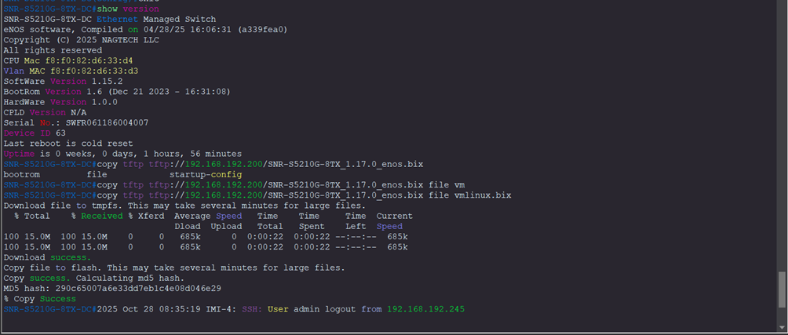
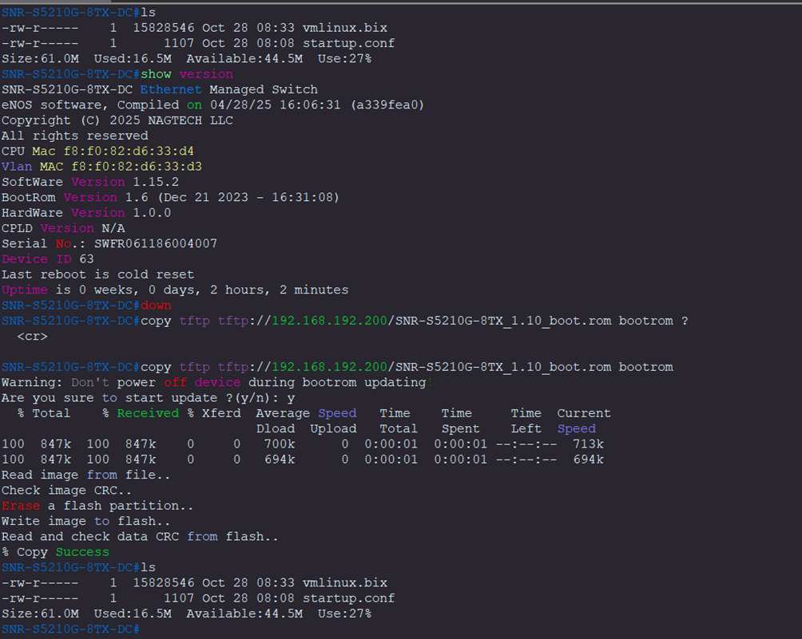

# Update SNR-S5120G-8TX-DC
> Check last Firmware and Readme (Release Notes)
```html
https://data.nag.wiki/SNR%20Switches/Firmware/SNR-S5210G-8TX/

https://nag.wiki/pages/viewpage.action?pageId=38765254
```
## Check version
```html
SNR-S5210G-8TX-DC#show version 
SNR-S5210G-8TX-DC Ethernet Managed Switch
eNOS software, Compiled on 04/28/25 16:06:31 (a339fea0)
Copyright (C) 2025 NAGTECH LLC
All rights reserved
CPU Mac f8:f0:82:d6:33:d4
Vlan MAC f8:f0:82:d6:33:d3
SoftWare Version 1.15.2
BootRom Version 1.6 (Dec 21 2023 - 16:31:08)
HardWare Version 1.0.0
CPLD Version N/A
Serial No.: <SN>
Device ID 63
Last reboot is cold reset
Uptime is 0 weeks, 0 days, 1 hours, 56 minutes
```
## Image Update
```html
SNR-S5210G-8TX-DC#copy tftp tftp://192.168.192.200/SNR-S5210G-8TX_1.17.0_enos.bix file vmlinux.bix
Download file to tmpfs. This may take several minutes for large files.
  % Total    % Received % Xferd  Average Speed   Time    Time     Time  Current
                                 Dload  Upload   Total   Spent    Left  Speed
100 15.0M  100 15.0M    0     0   685k      0  0:00:22  0:00:22 --:--:--  685k
100 15.0M  100 15.0M    0     0   685k      0  0:00:22  0:00:22 --:--:--  685k
Download success.
Copy file to flash. This may take several minutes for large files.
Copy success. Calculating md5 hash.
MD5 hash: 290c65007a6e33dd7eb1c4e08d046e29
% Copy Success
```
## Bootrom Update
```html
SNR-S5210G-8TX-DC#copy tftp tftp://192.168.192.200/SNR-S5210G-8TX_1.10_boot.rom bootrom 
Warning: Don't power off device during bootrom updating!
Are you sure to start update ?(y/n): y
  % Total    % Received % Xferd  Average Speed   Time    Time     Time  Current
                                 Dload  Upload   Total   Spent    Left  Speed
100  847k  100  847k    0     0   700k      0  0:00:01  0:00:01 --:--:--  713k
100  847k  100  847k    0     0   694k      0  0:00:01  0:00:01 --:--:--  694k
Read image from file..
Check image CRC..
Erase a flash partition..
Write image to flash..
Read and check data CRC from flash..
% Copy Success
```
## Reboot after update
```html
SNR-S5210G-8TX-DC#reload
 Warning : You may loose system configuration, if not saved
reboot system? (y/n): y
2025 Oct 28 08:40:16 HOSTP-2: System will be rebooted, reason: reload by CLI
The system is going down NOW!
Sent SIGTERM to all processes

% Connection is closed by administrator!
Sent SIGKILL to all processes
Requesting system reboot
```
## Check new Version
```html
SNR-S5210G-8TX-DC#show version 
SNR-S5210G-8TX-DC Ethernet Managed Switch
eNOS software, Compiled on 09/09/25 15:26:33 (3c7cdd4a)
Copyright (C) 2025 NAGTECH LLC
All rights reserved
CPU Mac f8:f0:82:d6:33:d4
Vlan MAC f8:f0:82:d6:33:d3
SoftWare Version 1.17.0
BootRom Version 1.10 (Jun 18 2025 - 13:02:18)
HardWare Version 1.0.0
CPLD Version N/A
Serial No.: <SN>
Device ID 63
Last reboot is warm reset
Uptime is 0 weeks, 0 days, 0 hours, 1 minutes
```

## Image update

