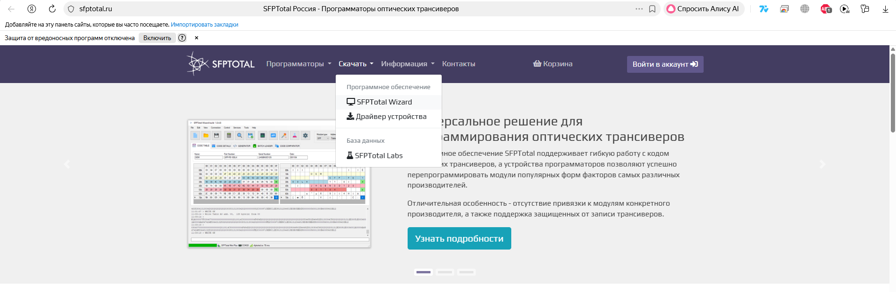
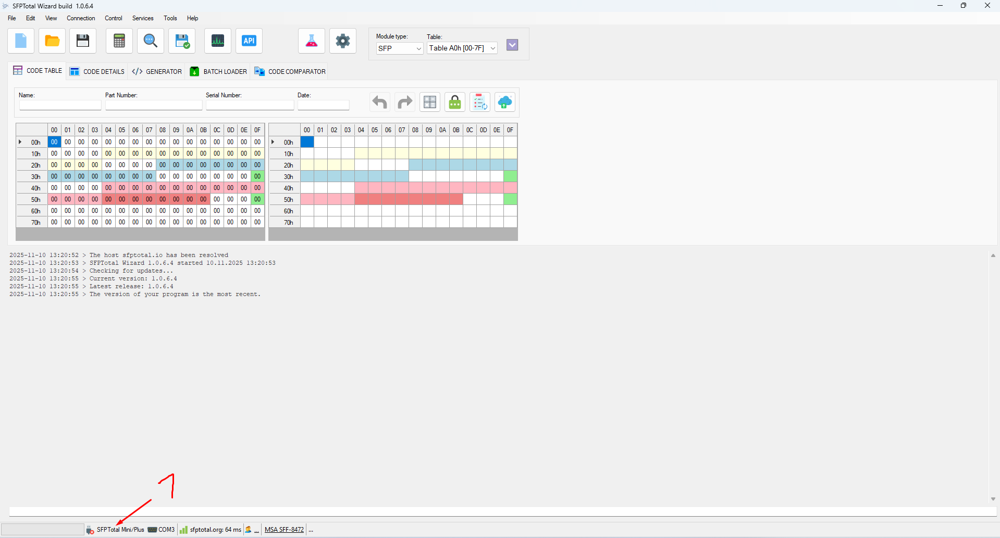
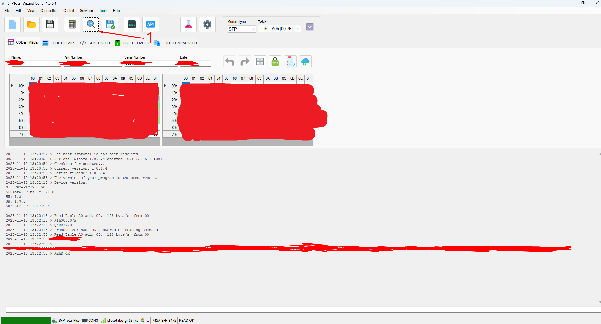
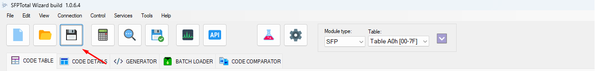
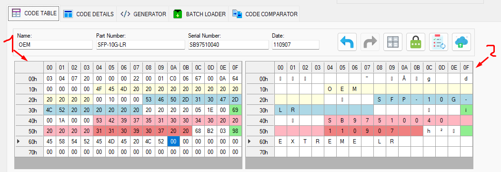
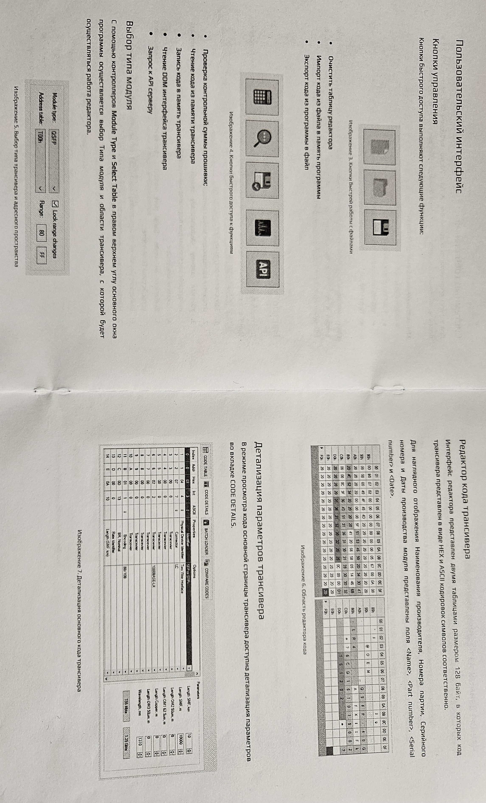
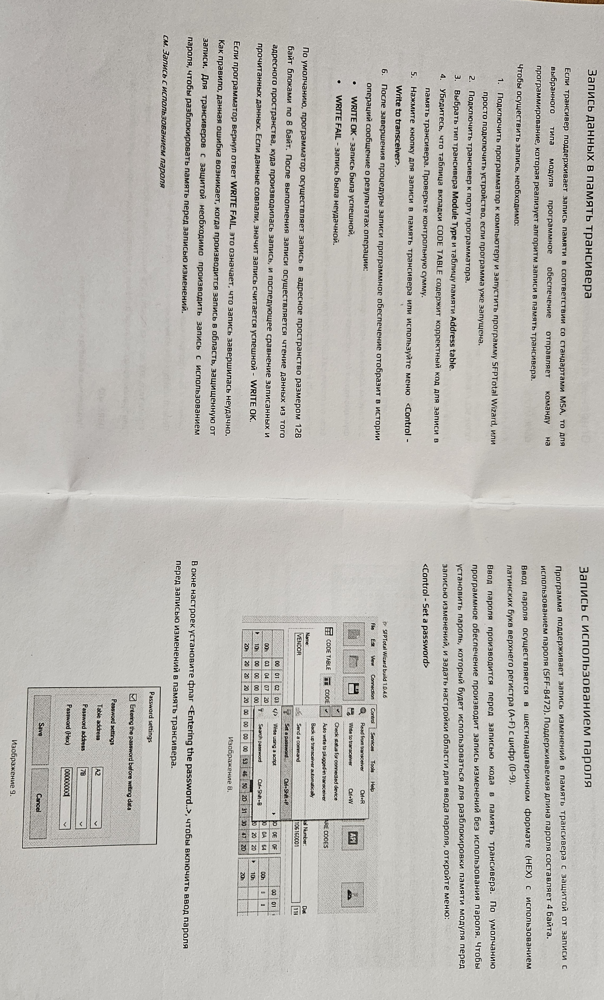

# SFPTtoal:
```html
https://sfptotal.ru/
```


1. Connect SFPTotal to PC
2. Launch SFPTotal Wizard.exe
3. Check Connect SFPTotal device (1)

4. Insert transceiver to SFPTotal
5. Choose "Module Type" (SFP) and Table (A0h,A2h), Click "Read code from module" (1)

6. Save Code in file:

```html
2025-11-10 13:30:44 > Saving file:
2025-11-10 13:30:44 > C:\Users\alexero\Desktop\<name_code>.bin
```
7. Code table transceiver
> 1 - HEX code, 2 - ASCII







# Memory structure of the transceiver
[SFPTotal_memory_structure_of_the_transceiver.pdf](pdf/SFPTotal_memory_structure_of_the_transceiver.pdf)