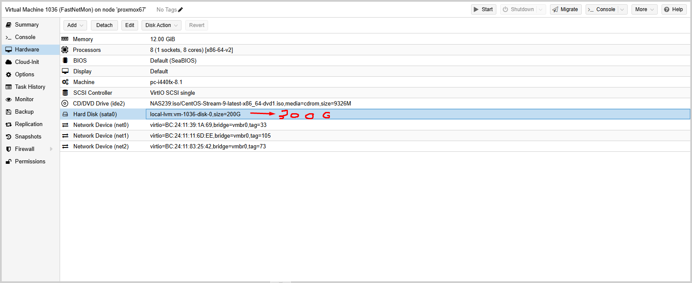
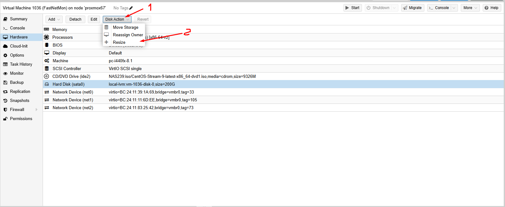
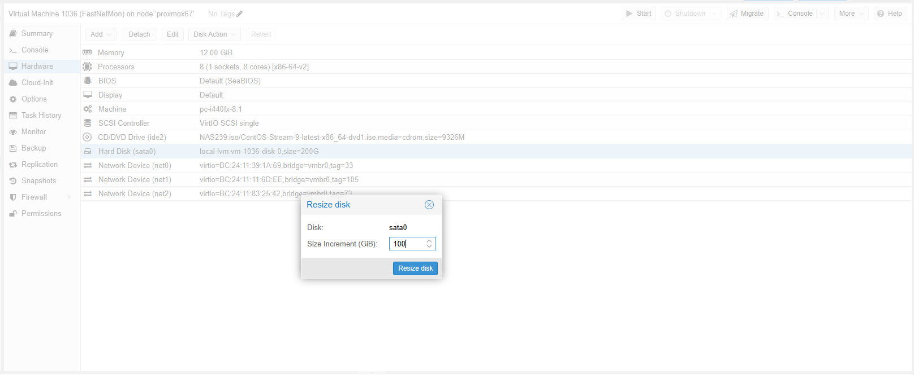
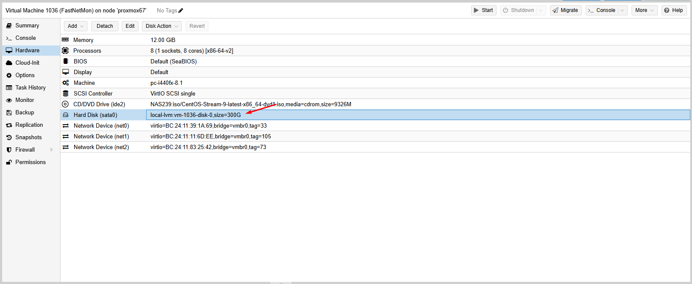
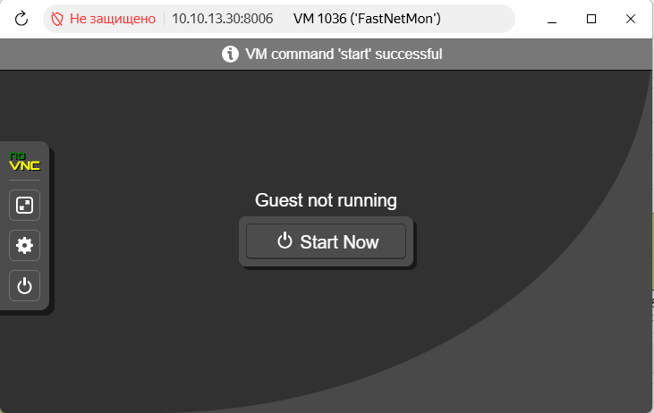
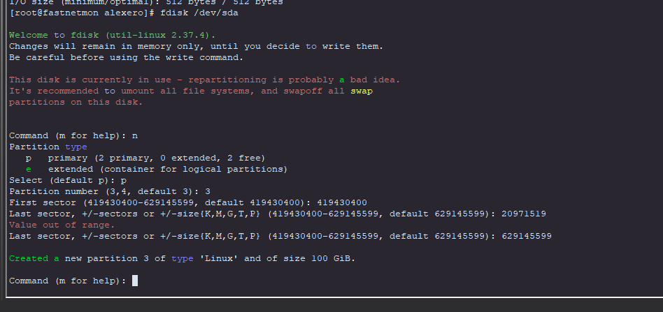
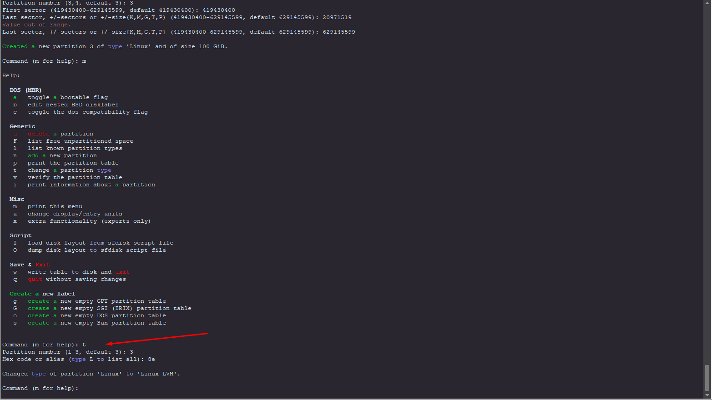
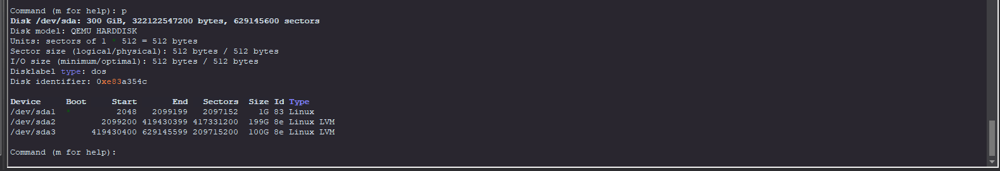
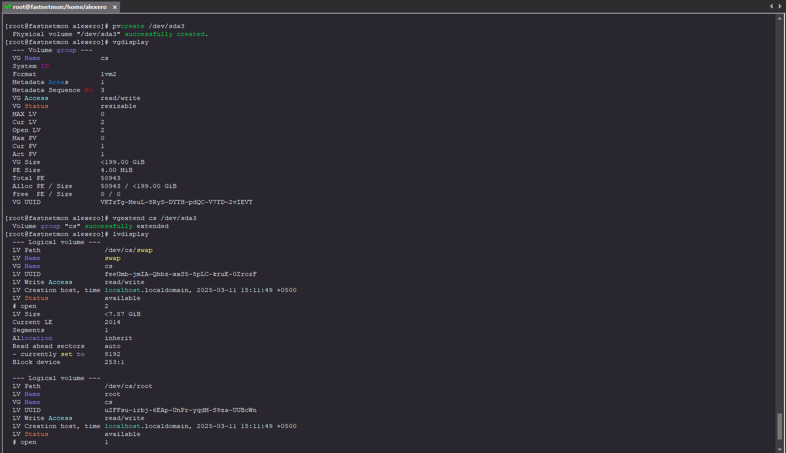
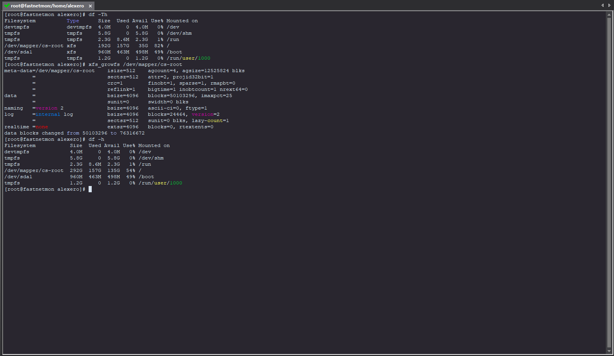

# Increase memory CentOS 9
> Attention! Make sure to make a backup copy of your data before you start LVM expansion work! (Take snapshot!!!)

## Introductory data:

```html
[root@fastnetmon alexero]# cat /etc/os-release 
NAME="CentOS Stream"
VERSION="9"
ID="centos"
ID_LIKE="rhel fedora"
VERSION_ID="9"
PLATFORM_ID="platform:el9"
PRETTY_NAME="CentOS Stream 9"
ANSI_COLOR="0;31"
LOGO="fedora-logo-icon"
CPE_NAME="cpe:/o:centos:centos:9"
HOME_URL="https://centos.org/"
BUG_REPORT_URL="https://issues.redhat.com/"
REDHAT_SUPPORT_PRODUCT="Red Hat Enterprise Linux 9"
REDHAT_SUPPORT_PRODUCT_VERSION="CentOS Stream"
```
```html
[root@fastnetmon alexero]# df -h
Filesystem           Size  Used Avail Use% Mounted on
devtmpfs             4.0M     0  4.0M   0% /dev
tmpfs                5.8G     0  5.8G   0% /dev/shm
tmpfs                2.3G  8.6M  2.3G   1% /run
/dev/mapper/cs-root  192G  154G   38G  81% /
/dev/sda1            960M  463M  498M  49% /boot
tmpfs                1.2G     0  1.2G   0% /run/user/1000
```
```html
[root@fastnetmon alexero]# fdisk -l
Disk /dev/sda: 200 GiB, 214748364800 bytes, 419430400 sectors
Disk model: QEMU HARDDISK   
Units: sectors of 1 * 512 = 512 bytes
Sector size (logical/physical): 512 bytes / 512 bytes
I/O size (minimum/optimal): 512 bytes / 512 bytes
Disklabel type: dos
Disk identifier: 0xe83a354c

Device     Boot   Start       End   Sectors  Size Id Type
/dev/sda1  *       2048   2099199   2097152    1G 83 Linux
/dev/sda2       2099200 419430399 417331200  199G 8e Linux LVM


Disk /dev/mapper/cs-root: 191.13 GiB, 205223100416 bytes, 400826368 sectors
Units: sectors of 1 * 512 = 512 bytes
Sector size (logical/physical): 512 bytes / 512 bytes
I/O size (minimum/optimal): 512 bytes / 512 bytes


Disk /dev/mapper/cs-swap: 7.87 GiB, 8447328256 bytes, 16498688 sectors
Units: sectors of 1 * 512 = 512 bytes
Sector size (logical/physical): 512 bytes / 512 bytes
I/O size (minimum/optimal): 512 bytes / 512 bytes
```
> A disk divided into 4 partitions can no longer be expanded!!!
> If your command output looks as shown above, everything is fine.
> You have only two partitions so far, /dev/sda1 and /dev/sda2. You can create two more.

> In this example, we have 1 200GB /dev/sda disk, which is divided into 2 logical disks: 
> the bootable /dev/sda1 and /dev/sda2 with the Linux LVM type, which is what we are interested in.
## (Step 1) Increase hard disk in virtualization environment (+100G)
> Poweroff virtual machine
```html
[root@fastnetmon alexero]# poweroff 
```
> In a virtualization environment, we increase the size of the hard disk and reboot the system.



> Increase hard disk to 100G:


> Check Result:



> Poweron virtual machine:



## (Step 2) Create partitions

> We see that /dev/sda has increased from 200 to 300G
```html
[root@fastnetmon alexero]# fdisk -l
Disk /dev/sda: 300 GiB, 322122547200 bytes, 629145600 sectors
Disk model: QEMU HARDDISK   
Units: sectors of 1 * 512 = 512 bytes
Sector size (logical/physical): 512 bytes / 512 bytes
I/O size (minimum/optimal): 512 bytes / 512 bytes
Disklabel type: dos
Disk identifier: 0xe83a354c

Device     Boot   Start       End   Sectors  Size Id Type
/dev/sda1  *       2048   2099199   2097152    1G 83 Linux
/dev/sda2       2099200 419430399 417331200  199G 8e Linux LVM


Disk /dev/mapper/cs-root: 191.13 GiB, 205223100416 bytes, 400826368 sectors
Units: sectors of 1 * 512 = 512 bytes
Sector size (logical/physical): 512 bytes / 512 bytes
I/O size (minimum/optimal): 512 bytes / 512 bytes


Disk /dev/mapper/cs-swap: 7.87 GiB, 8447328256 bytes, 16498688 sectors
Units: sectors of 1 * 512 = 512 bytes
Sector size (logical/physical): 512 bytes / 512 bytes
I/O size (minimum/optimal): 512 bytes / 512 bytes
```

>After increasing the disk size, you need to create a new partition. Let's run fdisk /dev/sda, where /dev/sda is the label of our disk (Disk /dev/sda):
```html
# fdisk /dev/sda
n - new partitional
p - primary
* - partitional number (3 or 4, by default, this is the next one with the number)

we specify the values separated by a hyphen:
First sector (419430400-629145599, default 419430400): 419430400
Last sector, +/-sectors or +/-size{K,M,G,T,P} (419430400-629145599, default 629145599): 629145599
```
`If everything is fine, we will receive a message:`
>Created a new partition 3 of type 'Linux' and of size 100 GiB.
```html
t - change a partition type
* - partitional number
8e - new hex code
```
`If everything is fine, we will receive a message:`
>Changed type of partition 'Linux' to 'Linux LVM'.

### Example of a complete procedure:
#### Text:
```html
[root@fastnetmon alexero]# fdisk /dev/sda

Welcome to fdisk (util-linux 2.37.4).
Changes will remain in memory only, until you decide to write them.
Be careful before using the write command.

This disk is currently in use - repartitioning is probably a bad idea.
It's recommended to umount all file systems, and swapoff all swap
partitions on this disk.


Command (m for help): n
Partition type
   p   primary (2 primary, 0 extended, 2 free)
   e   extended (container for logical partitions)
Select (default p): p
Partition number (3,4, default 3): 3
First sector (419430400-629145599, default 419430400): 419430400
Last sector, +/-sectors or +/-size{K,M,G,T,P} (419430400-629145599, default 629145599): 629145599

Created a new partition 3 of type 'Linux' and of size 100 GiB.

Command (m for help): 
```
```html
Command (m for help): t
Partition number (1-3, default 3): 3
Hex code or alias (type L to list all): 8e

Changed type of partition 'Linux' to 'Linux LVM'.
```
```html
Command (m for help): p
Disk /dev/sda: 300 GiB, 322122547200 bytes, 629145600 sectors
Disk model: QEMU HARDDISK   
Units: sectors of 1 * 512 = 512 bytes
Sector size (logical/physical): 512 bytes / 512 bytes
I/O size (minimum/optimal): 512 bytes / 512 bytes
Disklabel type: dos
Disk identifier: 0xe83a354c

Device     Boot     Start       End   Sectors  Size Id Type
/dev/sda1  *         2048   2099199   2097152    1G 83 Linux
/dev/sda2         2099200 419430399 417331200  199G 8e Linux LVM
/dev/sda3       419430400 629145599 209715200  100G 8e Linux LVM
```
```html
Command (m for help): w
The partition table has been altered.
Syncing disks.
```
> Great! We have created a 100 GB /dev/sda3 partition. 
> All that remains is to save the changes with the "w" command. 
> After that, fdisk will automatically close:
#### Screenshots





## (Step 3) To use the created volume in LVM, initialize it:
> Initialization section
```html
[root@fastnetmon alexero]# pvcreate /dev/sda3
  Physical volume "/dev/sda3" successfully created.
```
> Let's see the name of the volume group to which you want to add a section. 
> To do this, we'll use "vgdisplay". By default– this is cs:
```html
[root@fastnetmon alexero]# vgdisplay
  --- Volume group ---
  VG Name               cs
  System ID             
  Format                lvm2
  Metadata Areas        1
  Metadata Sequence No  3
  VG Access             read/write
  VG Status             resizable
  MAX LV                0
  Cur LV                2
  Open LV               2
  Max PV                0
  Cur PV                1
  Act PV                1
  VG Size               <199.00 GiB
  PE Size               4.00 MiB
  Total PE              50943
  Alloc PE / Size       50943 / <199.00 GiB
  Free  PE / Size       0 / 0   
  VG UUID               VKTzTg-MeuL-8RyS-DYTH-pdQC-V7TD-2vIEVT
```
> Adding our section to this group:
```html
[root@fastnetmon alexero]# vgextend cs /dev/sda3
  Volume group "cs" successfully extended
```
> Using "lvdisplay", we look at the name and path to the logical volume that needs to be expanded 
> (by default, these are root and /dev/cs/root):
```html
[root@fastnetmon alexero]# lvdisplay
  --- Logical volume ---
  LV Path                /dev/cs/swap
  LV Name                swap
  VG Name                cs
  LV UUID                feeUmb-jmIA-Qhbz-xxS5-5pLC-kruE-0ZrozF
  LV Write Access        read/write
  LV Creation host, time localhost.localdomain, 2025-03-11 15:11:49 +0500
  LV Status              available
  # open                 2
  LV Size                <7.87 GiB
  Current LE             2014
  Segments               1
  Allocation             inherit
  Read ahead sectors     auto
  - currently set to     8192
  Block device           253:1
   
  --- Logical volume ---
  LV Path                /dev/cs/root
  LV Name                root
  VG Name                cs
  LV UUID                u2FFsu-irbj-6EAp-UnPr-yqdM-S9za-UUBcWn
  LV Write Access        read/write
  LV Creation host, time localhost.localdomain, 2025-03-11 15:11:49 +0500
  LV Status              available
  # open                 1
  LV Size                <191.13 GiB
  Current LE             48929
  Segments               1
  Allocation             inherit
  Read ahead sectors     auto
  - currently set to     8192
  Block device           253:0
```
> Now let's expand it. To do this, "lvextend" specifies the path to the logical volume and the parameter -l +100%FREE, 
> which indicates that we want to use 100% of the free space.:
```html
[root@fastnetmon alexero]# lvextend -l +100%FREE /dev/cs/root
  Size of logical volume cs/root changed from <191.13 GiB (48929 extents) to 291.12 GiB (74528 extents).
  Logical volume cs/root successfully resized.
```

### Example of a complete procedure:



## (Step 4) Expand the file system

> Attention! Check filesystem type: (xfs - default CentOS 9)
```html
[root@fastnetmon alexero]# df -Th
Filesystem          Type      Size  Used Avail Use% Mounted on
devtmpfs            devtmpfs  4.0M     0  4.0M   0% /dev
tmpfs               tmpfs     5.8G     0  5.8G   0% /dev/shm
tmpfs               tmpfs     2.3G  8.6M  2.3G   1% /run
/dev/mapper/cs-root xfs       192G  157G   35G  82% /
/dev/sda1           xfs       960M  463M  498M  49% /boot
tmpfs               tmpfs     1.2G     0  1.2G   0% /run/user/1000
```
> if "Type: xfs", then "xfs_growfs"
```html
[root@fastnetmon alexero]# xfs_growfs /dev/mapper/cs-root
meta-data=/dev/mapper/cs-root    isize=512    agcount=4, agsize=12525824 blks
         =                       sectsz=512   attr=2, projid32bit=1
         =                       crc=1        finobt=1, sparse=1, rmapbt=0
         =                       reflink=1    bigtime=1 inobtcount=1 nrext64=0
data     =                       bsize=4096   blocks=50103296, imaxpct=25
         =                       sunit=0      swidth=0 blks
naming   =version 2              bsize=4096   ascii-ci=0, ftype=1
log      =internal log           bsize=4096   blocks=24464, version=2
         =                       sectsz=512   sunit=0 blks, lazy-count=1
realtime =none                   extsz=4096   blocks=0, rtextents=0
data blocks changed from 50103296 to 76316672
```
> if "Type: ext4", then "resize2fs":
Example:
```html
# resize2fs -p /dev/mapper/cl-root

resize2fs 1.42.9 (28-Dec-2013)
Filesystem at /dev/mapper/cl-root is mounted on /; on-line resizing required
old desc_blocks = 1, new_desc_blocks = 2
Performing an on-line resize of /dev/mapper/cl-root to 2147328 (4k) blocks.
The filesystem on /dev/mapper/cl-root is now 2147328 blocks long.
```

> Check result:
```html
[root@fastnetmon alexero]# df -h
Filesystem           Size  Used Avail Use% Mounted on
devtmpfs             4.0M     0  4.0M   0% /dev
tmpfs                5.8G     0  5.8G   0% /dev/shm
tmpfs                2.3G  8.6M  2.3G   1% /run
/dev/mapper/cs-root  292G  157G  135G  54% /
/dev/sda1            960M  463M  498M  49% /boot
tmpfs                1.2G     0  1.2G   0% /run/user/1000
```

### Example of a complete procedure:

