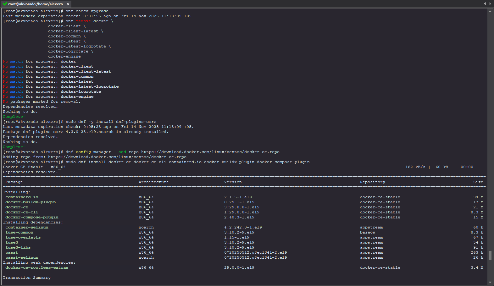
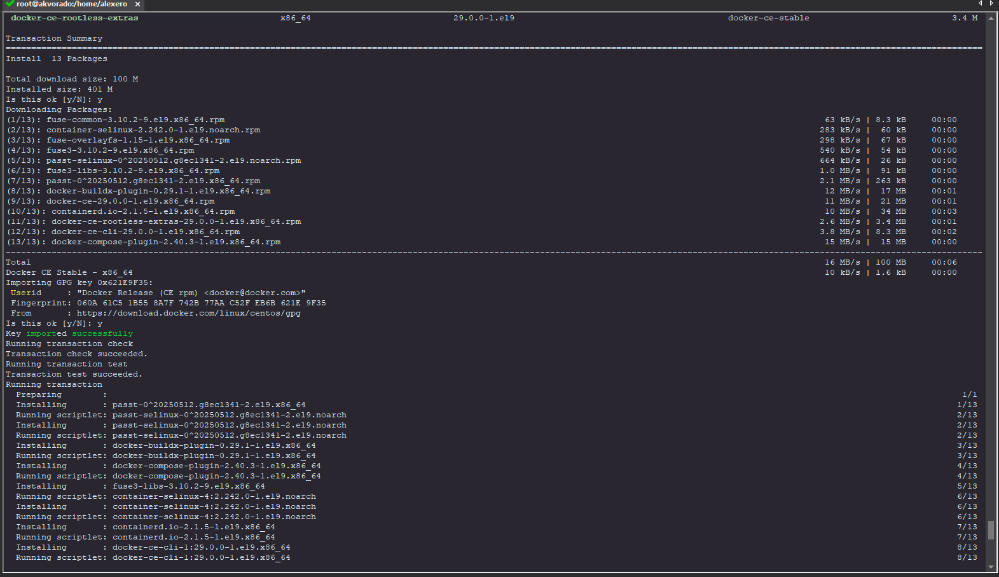
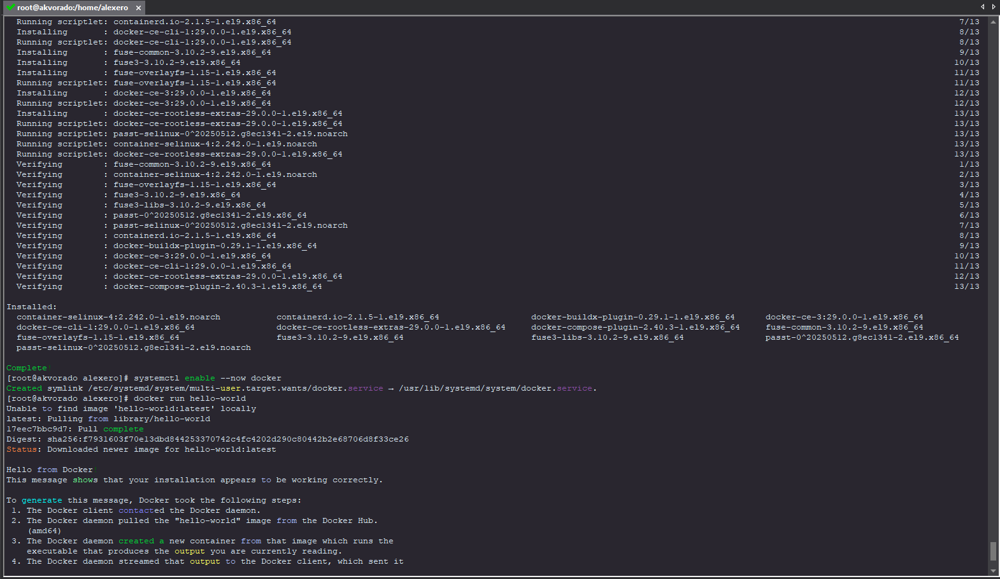
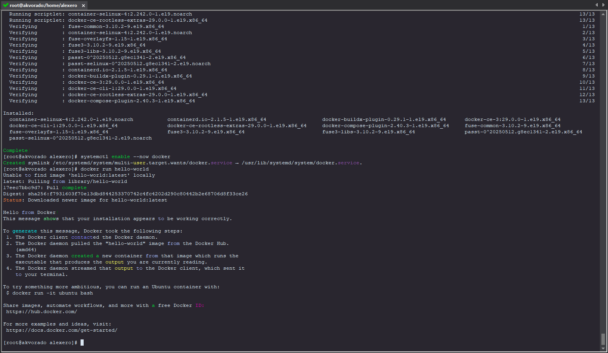
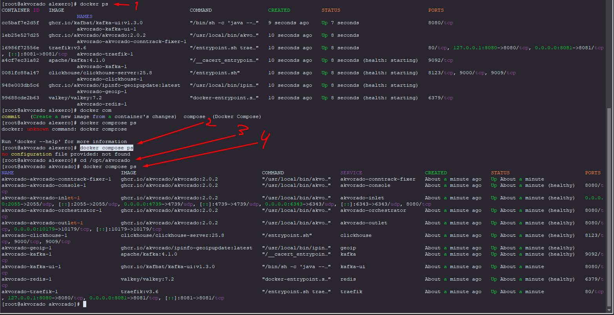

# Docker

## Centos 9

> https://dcs.docker.com/engine/install/centos/

### Install CentOS 9 (Install using the rpm repository)

> The centos-extras repository must be enabled. 
> This repository is enabled by default. 
> If you have disabled it, you need to re-enable it.
> Before you can install Docker Engine, you need to uninstall any conflicting packages.
```bash
dnf remove docker \
                  docker-client \
                  docker-client-latest \
                  docker-common \
                  docker-latest \
                  docker-latest-logrotate \
                  docker-logrotate \
                  docker-engine
```
> Before you install Docker Engine for the first time on a new host machine, you need to set up the Docker repository. 
> Afterward, you can install and update Docker from the repository.
```bash
dnf -y install dnf-plugins-core
dnf config-manager --add-repo https://download.docker.com/linux/centos/docker-ce.repo
```
1. Install the Docker packages (Latest)
> To install the latest version
> If prompted to accept the GPG key, verify that the fingerprint matches
> 060A 61C5 1B55 8A7F 742B 77AA C52F EB6B 621E 9F35, and if so, accept it.
> 
> This command installs Docker, but it doesn't start Docker. 
> It also creates a docker group, however, it doesn't add any users to the group by default.
```bash
dnf -y install docker-ce docker-ce-cli containerd.io docker-buildx-plugin docker-compose-plugin
```
2. Start Docker Engine
```bash
systemctl enable --now docker
```
3. Verify that the installation is successful by running the hello-world image:\
```bash
docker run hello-world
```
> This command downloads a test image and runs it in a container. 
> When the container runs, it prints a confirmation message and exits.

#### Example Install CentOS 9:





```bash
[root@akvorado alexero]# docker run hello-world
Unable to find image 'hello-world:latest' locally
latest: Pulling from library/hello-world
17eec7bbc9d7: Pull complete 
Digest: sha256:f7931603f70e13dbd844253370742c4fc4202d290c80442b2e68706d8f33ce26
Status: Downloaded newer image for hello-world:latest

Hello from Docker!
This message shows that your installation appears to be working correctly.

To generate this message, Docker took the following steps:
 1. The Docker client contacted the Docker daemon.
 2. The Docker daemon pulled the "hello-world" image from the Docker Hub.
    (amd64)
 3. The Docker daemon created a new container from that image which runs the
    executable that produces the output you are currently reading.
 4. The Docker daemon streamed that output to the Docker client, which sent it
    to your terminal.

To try something more ambitious, you can run an Ubuntu container with:
 $ docker run -it ubuntu bash

Share images, automate workflows, and more with a free Docker ID:
 https://hub.docker.com/

For more examples and ideas, visit:
 https://docs.docker.com/get-started/
```
```bash
[root@akvorado docker]# docker compose version
Docker Compose version v2.40.3
[root@akvorado docker]# docker --version
Docker version 29.0.0, build 3d4129b
```

### Config Docker after install

#### Configure Docker to start on boot with systemd

```bash
systemctl enable docker.service
systemctl enable containerd.service
```

#### Configure default logging driver

## Docker Commands
```bash
docker compose up --- Launching the app
docker compose up -d  --- Running in the background
docker compose down --- Stopping the app
docker compose down -v --- Full stop with data deletion
docker compose ps --- Viewing the status
docker compose logs -f --- Viewing logs in RealTime (-f)
docker compose logs akvorado-console --- example log a specific service
docker compose pull --- example update Docker images specified in your docker-compose file.yml

docker system df

```
```bash
docker ps --- It will show if there are any containers running on the server
docker compose ps --- Viewing the status containers (it only works if there is a configuration file/change directory)
```
### Restart container
```bash
cd /opt/...
docker compose down && docker compose up -d
```

### Example:
> 1. "docker ps"
> 
> 2. "docker compose ps"
> 
> 3. change directory to docker compose
> 
> 4. again "docker compose ps"



### Example:

